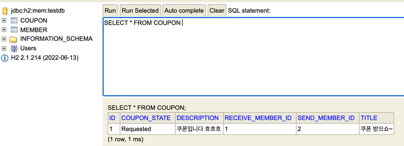
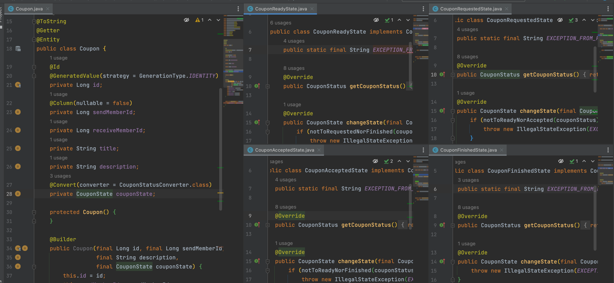
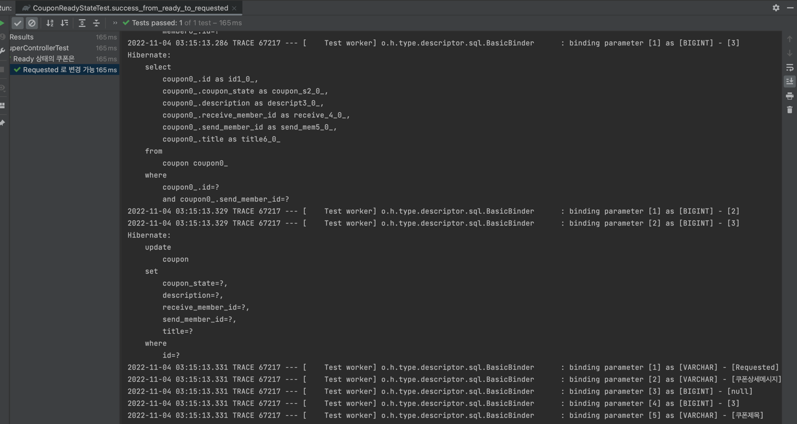

### 상태패턴, JPA

- 쿠폰 상태 : Ready -> Requested -> Accepted -> Finished
- Coupon 엔티티가 Coupon상태 인터페이스를 필드로 지님.
- Coupon 엔티티는 Coupon상태 변경 요청이 오면 상태 인터페이스에게 요청을 넘김.
- 상태 인터페이스 구현체는 자신의 상태와 변경 신청 상태를 확인하여 예외를 던지거나 새로운 상태를 반환함
- 예외 없이 새로운 상태가 반환되면, Coupon 엔티티는 이를 자신의 상태로 할당함
- JPA Dirty Check를 통한 Update처리를 꾀함
- 단, Entity 필드가 인터페이스이고, 실제 DB값에 따른 구현체가 매핑되어야함
- 이 매핑 처리는 Converter를 직접 구현하여 처리

<br><br>

### Entity 내에 필드를 Spring에선 전략패턴 구현체로, DB에선 Enum.String으로



- DB에는 CouponStatus Enum.String으로 저장되어 있다

<br><br>



- Entity 필드에는 CouponState 상태 인터페이스로 선언되어 있다

<br><br>



- 회원 insert, Ready 쿠폰 insert 이후 Requested로 상태변경 요청을 전송했다.
- 정상적으로 Dirty Check를 통한 Update가 수행되었음을 알 수 있다

<br><br>

```java

@Converter
public class CouponStatusConverter implements AttributeConverter<CouponState, String> {
    @Override
    public String convertToDatabaseColumn(final CouponState attribute) {
        return attribute.getCouponStatus().name();
    }

    @Override
    public CouponState convertToEntityAttribute(final String dbData) {
        final var couponStatus = CouponStatus.from(dbData);

        return couponStatus.getConcrete();
    }
}
```

- DB와 Entity간의 값 변환은 Converter가 수행한다.
- Entity를 DB에 저장할 땐 어떻게 변환할지,
  DB값을 조회할 땐 어떻게 매핑할지 두 가지 메서드를 오버라이드 한다.
- DB 저장시엔 상태 패턴 인터페이스에 정의한 상태 Enum을 반환하는 메서드를 호출하여 String을 저장한다.
- 조회시엔 조회된 Enum.String을 Enum의 static 메서드를 통해 어떤 Enum인지 찾아낸 뒤, Enum을 통해 상태패턴 구현체를 받아낸다.

<br><br>

```java
public enum CouponStatus {
    Ready(CouponReadyState::new),
    Requested(CouponRequestedState::new),
    Accepted(CouponAcceptedState::new),
    Finished(CouponFinishedState::new),
    ;

    private final Supplier<CouponState> couponStateSupplier;

    CouponStatus(final Supplier<CouponState> couponStateSupplier) {
        this.couponStateSupplier = couponStateSupplier;
    }

    public static CouponStatus from(final String dbData) {
        return Arrays.stream(CouponStatus.values())
                .filter(value -> value.name().equalsIgnoreCase(dbData))
                .findAny()
                .orElseThrow();
    }

    public CouponState getConcrete() {
        return couponStateSupplier.get();
    }
}
```

- Enum의 필드로 Supplier<CouponState>를 선언해두었다.
- 이로 인해 각 상태 패턴 구현체 내에서도 매개변수로 전달된 CouponStatus의 getConcrete라는 일관된 메서드만 호출하여 반환값을 설정했다.
- 이후 추가로 상태가 구현되더라도 기존 구현부엔 변경이 없는 구조가 가능해졌다.

<br><br>

### Ready

> 쿠폰 최초 발행 상태

- Ready -> Ready : 불가. 같은 상태여서.
- Ready -> Requested : 가능. 쿠폰 사용 신청.
- Ready -> Accepted : 불가. 신청 없이 수락 처리 불가.
- Ready -> Finished : 가능. 쿠폰 만료 처리

<br><br>

### Requested

> 쿠폰 사용 신청 상태

- Requested -> Ready : 가능. 사용 신청 취소.
- Requested -> Requested : 불가. 같은 상태여서.
- Requested -> Accepted : 가능. 상대방의 사용 수락 처리.
- Requested -> Finished : 불가. 상대 수락 대기중에 만료처리는 불가.

<br><br>

### Accepted

> 쿠폰 사용 수락 상태

- Accepted -> Ready : 가능. 수락한 이후에 한 쪽이 변심하여 취소처리할 경우 쿠폰 복구.
- Accepted -> Requested : 불가. 수락 상태에서 요청 상태로는 불가.
- Accepted -> Accepted : 불가. 같은 상태여서
- Accepted -> Finished : 가능. 수락 후 사용 완료 시 처리

<br><br>

### Finished

> 쿠폰 사용 완료 혹은 만료 상태

- Finished 에서는 어느 상태로도 변경 불가함


- Finished -> Ready : 불가
- Finished -> Requested : 불가
- Finished -> Accepted : 불가
- Finished -> Finished : 불가

<br><br>
